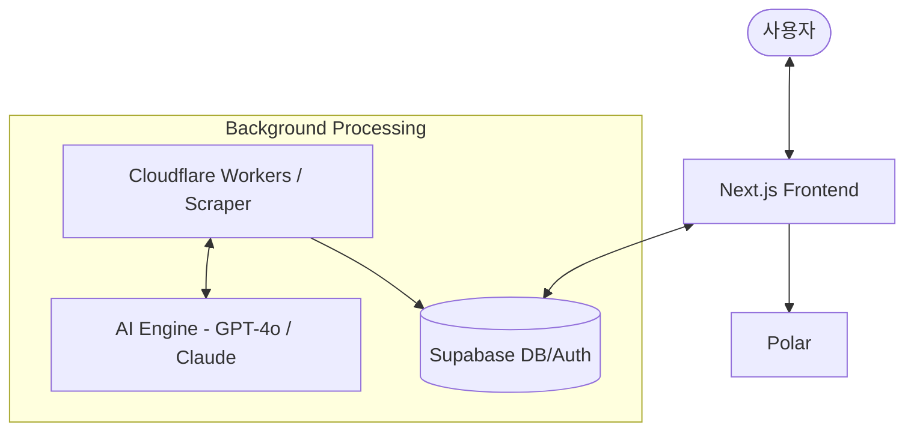

# PRD (Product Requirement Document) - Trend Intelligence

## 1. 프로젝트 개요 및 목표
본 프로젝트의 최우선 목표는 **'수익성 있는 서비스 아이디어를 발굴하고 도출하는 것'**입니다. AI를 활용해 시장의 결핍을 데이터 기반으로 찾아내고, 실제 서비스 개발 후 광고를 통한 유입량 측정을 통해 비즈니스의 지속 가능성을 사용자가 직접 판단할 수 있도록 돕는 시스템을 구축합니다.

- **핵심 목표**: 커뮤니티 및 글로벌 마켓의 데이터를 분석하여 사람들이 실제로 돈을 지불할 용의가 있는 '수익성 높은 서비스'를 발굴하고 자원을 효율적으로 배분함.
- **AI의 역할**:
  1. **통계적 니즈 도출**: 단일 게시글 분석을 넘어, 각 커뮤니티에서 논하고 있는 공통 키워드를 추출하고 통계적으로 유의미한 사용자 니즈를 분석함.
  2. **해결 가이드 제공**: 도출된 문제점에 대해 어떤 방식으로 기술적/비즈니스적 해결이 가능한지에 대한 간단한 실행 가이드를 제시함.

## 2. 전략적 포지셔닝 및 차별화 (Pivot Strategy)
기존 글로벌 트렌드 서비스(Exploding Topics 등)와의 차별화를 위해 **"Global Data, Local Insight"** 전략을 채택합니다.

- **Bottom-up Discovery**: 단순 트렌드 정보를 넘어 "대중이 반복적으로 호소하는 페인포인트"를 통계적으로 추출하여 제공함.
- **Hyper-Localization (핵심 경쟁력)**: 글로벌 트렌드를 한국적 경제 상황, 법규, 사용자 행동에 맞춰 재해석함. "미국에서 뜨는 이 모델을 한국에서 어떻게 실행(How-to)할 것인가"에 대한 구체적 가이드를 제공함.
- **Actionable Intelligence**: 정보 제공을 넘어 한국향 비즈니스 복제 및 변형 전략을 제안하는 '지능형 에이전트'로 포지셔닝함.

## 3. 타겟 시장 및 진입 단계 (Market Phase)
자원의 효율적 배분을 위해 단계별로 시장을 확장합니다.

- **PHASE 1 (현재)**: **한국 시장 선점**. 한국인 창업자, 1인 개발자, 프리랜서를 타겟으로 '글로벌 트렌드 → 한국형 이식' 가이드를 제공하여 수익성을 검증함.
- **PHASE 2 (미래)**: **글로벌 확장**. 한국 시장에서 검증된 '니즈 도출 및 가이드 생성' 알고리즘을 영어권 및 타 아시아 국가 시장으로 수평 확장함.

## 4. 핵심 기능 및 질문에 대한 해답
사람들이 필요로 하는 서비스가 무엇인지 검색해서 도출해 내는 프로세스를 정의합니다.

- **1차 목표 (니즈 도출)**: 각 커뮤니티(Reddit, PH 등)에서 논의되는 공통 키워드를 어떻게 통계적으로 추출하고, 이를 수익성 있는 니즈로 변환할 것인가에 집중함.
- **해결 방안 제시**: 발견된 문제 해결을 위해 필요한 기술 스택이나 비즈니스 모델에 대한 간단한 가이드라인을 AI가 생성하여 제공함.
- **비즈니스 지속성 판단 (사용자 몫)**: AI는 판단 기준(Benchmarking)을 제시할 뿐, 실제 지속 여부는 랜딩 페이지 배포 및 초기 광고 캠페인을 통한 '유입량 지표'를 보고 사용자가 최종 결정함.

## 5. 비즈니스 검증 프레임워크 (Customer Needs Verification)
본 프로젝트는 코드를 짜기 전, 아래 4단계의 '비즈니스 플레이북'을 통해 시장의 니즈를 선검증합니다.

1. **정량적 트래픽 분석 (검색 데이터 기반)**: Google Trends 및 블랙키위 등을 활용하여 키워드의 '월간 검색량'과 '연관 검색어'를 분석, 대중이 겪는 구체적인 문제를 정의합니다.
2. **경쟁사 및 커뮤니티 페인포인트 크롤링**: 크몽, 클래스101, 블라인드 등에서 경쟁 상품의 '낮은 평점 리뷰'와 반복되는 질문을 수집하여 핵심 셀링 포인트를 도출합니다.
3. **프리세일즈 (Fake Door Test)**: 상세페이지(랜딩 페이지)를 먼저 제작하고 [사전예약] 또는 [결제하기] 버튼의 CVR(전환율)을 측정하여 실제 결제 의사를 검증합니다.
4. **마이크로 타겟팅과 페르소나 딥다이브**: 타겟을 극단적으로 좁혀(예: '1년 차 프론트엔드 개발자') 그들의 시간을 정확히 몇 시간 아껴줄 수 있는지 숫자로 제안합니다.

## 6. 수익화 및 성장 전략
- **B2B 타겟 제휴 수익**: 구글 애드센스와 같은 일반 디스플레이 광고는 서비스의 신뢰도 저하 및 사용자 이탈 우려로 지양. 대신 개발자/창업자 타겟에 맞는 고단가 **제휴 마케팅(Affiliate)** 링크(예: 서버 호스팅, 도메인 등)를 활용.
- **Lean 시장성 검증**: 복잡한 메일링 기능 구축을 배제하고, 초기에는 리포트 일부분만 공개한 상태에서 가치에 공감하는 잠재 고객들의 피드백이나 비즈니스 문의(Contact)를 받을 수 있는 단순 채널(이메일 발송 링크 폼 등)만 열어두어 최소 리소스로 수요를 탐색함.
- **유료화 결제 (Polar)**: 글로벌/북미 타겟 오픈소스 PG인 **Polar**를 연동하여 특정 리포트당 마이크로 결제($1~5)를 유도. 고가의 정기 구독보다 결제 허들을 낮춰 시장성을 빠르게 검증.
- **리텐션(Retention)**: 단순 정보 열람을 넘어 유저가 아이디어를 검증하고 관리하는 '워크스페이스' 기능을 제공하여 지속적인 방문을 유도함.

## 7. 운영 및 도메인 전략
- **초기 MVP 검증 단계**: Vercel을 통해 모회사 도메인의 서브도메인(`trend.gonsuit.com`)으로 서비스 런칭. 도메인 유지비 및 관리 리소스를 0으로 유지하고 본진 사이트(`gonsuit.com`)의 브랜드 및 SEO 후광 효과(크로스셀링)를 적극 활용함.
- **성장 및 독립 단계**: 전환율 및 마이크로 결제 등 유의미한 지표 달성 시, 전용 독립 도메인(`trendscouter.com` 등)으로 완전 스핀오프(Spin-off) 분리 독립.
- **마이그레이션 리스크 관리**: 향후 독립 도메인 이전 시 트래픽 및 권위(DA) 유실 방지를 위해 기존 서브도메인에 대한 **301 영구 리다이렉션(Permanent Redirect)** 세팅 및 Supabase 인증 설정(Auth URL) 분리 연동 작업을 필수 적용함.

## 8. 서버 구성도

서비스의 효율적인 운영과 확장을 위해 다음과 같은 아키텍처를 구성합니다.

### 기술 아키텍처 (Technical Stack)
- **Frontend**: Next.js 14 (App Router) + Tailwind CSS (Vercel 호스팅)
- **Database/Auth**: Supabase (PostgreSQL & GoTrue)
- **Worker (Scraper)**: Cloudflare Workers / GitHub Actions
- **AI Engine**: OpenAI GPT-4o / Claude 3.5 Sonnet
- **Payments**: Polar

---
*참조 및 연동: [2.PDP.md](file:///e:/Work_Gon/260305_checkService/2.PDP.md)*
