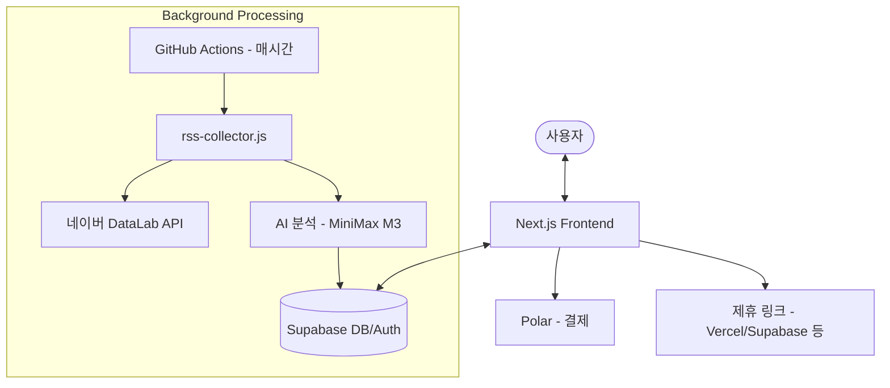

# PRD (Product Requirement Document) - Trend Scouter

## 1. 프로젝트 개요 및 목표
본 프로젝트의 최우선 목표는 **'AI 코딩 도구 사용자가 바로 실행할 수 있는 수익형 아이디어를 발굴하고 제공하는 것'**입니다. AI를 활용해 시장의 결핍을 데이터 기반으로 찾아내고, 찾아낸 아이디어를 어떤 AI 코딩 도구(Claude Code, ChatGPT, Gemini 등)에도 바로 붙여넣을 수 있는 형태로 제공합니다.

- **핵심 목표**: 커뮤니티 데이터와 AI 분석을 통해 PUFE 프레임워크 기반의 '실제 해결 가치가 높은 페인포인트'를 발굴하고, 바이브 코더(Vibe Coder)가 즉시 실행할 수 있는 형태의 개발 브리프를 제공함.
- **서비스 포지셔닝**: `"주말에 만들어볼 수 있는 수익형 사이드 프로젝트 아이디어"` — Hacker News, GitHub, Dev.to, GeekNews에서 사람들이 실제로 돈을 내는 문제만 골라 AI 개발 브리프 형태로 제공하는 서비스.
- **AI의 역할**:
  1. **통계적 니즈 및 PUFE 도출**: 커뮤니티 데이터에서 통계적 유의미성(빈도, 상승률)을 추출하고, PUFE(Pain, Urgency, Frequency, Existing Solution) 스코어를 산출함.
  2. **AI 개발 브리프 자동 생성**: 도출된 아이디어를 Claude Code, ChatGPT, Gemini 등 어떤 AI 코딩 도구에도 바로 붙여넣을 수 있는 `.md` 형태의 개발 기획서를 자동으로 생성함.
  3. **한국 시장 적합성 검증**: 네이버 DataLab 검색 관심도 지수(상대값 0~100)를 교차 주입하여 "글로벌 트렌드가 한국에서도 수요가 있는지" 데이터 기반으로 검증함.

## 2. 전략적 포지셔닝 및 차별화 (Pivot Strategy)
기존 글로벌 트렌드 서비스(Exploding Topics 등)와의 차별화를 위해 **"실행 가능한 아이디어"** 전략을 채택합니다.

- **Bottom-up Discovery**: 단순 트렌드 정보를 넘어 "대중이 반복적으로 호소하는 페인포인트"를 PUFE 지표로 객관화하여 제공함.
- **Hyper-Localization (핵심 경쟁력)**: 글로벌 트렌드를 한국적 상황에 맞춰 재해석. 네이버 DataLab 검색 관심도 지수(상대값 0~100)를 PUFE 프롬프트에 교차 주입하여 "한국에서도 팔리는지"를 검증함. 글로벌 + 한국 듀얼 파이프라인 구축. (상세: §4-A 참조)
- **AI-Ready Output**: 분석 결과물을 AI 코딩 도구에 바로 붙여넣을 수 있는 마크다운 브리프 형태로 제공. 특정 도구(Cursor 등)에 종속되지 않고 Claude Code, ChatGPT, Gemini 등 모든 AI 도구와 호환.
- **Stats-Only Principle**: 본문 내용 대신 언급 횟수, 성장률 등 통계 데이터 중심으로 정보를 노출하여 데이터의 투명성과 법적 안전성을 확보함.

## 3. 핵심 기능 (Main Features)
- **통계 기반 트렌드 분석 (Stats-Only)**: 본문 수집 대신 수치(Upvotes, 성장률) 중심의 PUFE 분석 리포트 제공.
- **AI 개발 브리프 자동 생성 (AI Prompt Copy)**: 각 아이디어에 대해 AI 코딩 도구에 바로 붙여넣을 수 있는 마크다운 형태의 개발 기획서를 자동 생성. (타겟 유저, MVP 기능, 기술 스택, 예상 개발 기간, 수익 가능성 포함)
- **AI 개발 난이도 지표 (AI Buildability Score)**: PUFE 스코어 외에 "AI 코딩 도구로 얼마나 쉽게 만들 수 있는지"를 1~5단계로 추가 제공. (1=하루, 5=한 달 이상)
- **수익화 실행 가속 4종 패키지 (Paid Value)**: Polar Checkout으로 잠금 해제.
    - **Lean Canvas**: 한 페이지로 정리된 비즈니스 구조 리포트.
    - **GTM 광고 카피**: 타겟 고객별 맞춤형 인스타그램/뉴스레터 문구 3~5종.
    - **채널 진입 가이드**: 한국 내 초기 고객 확보(GTM)를 위한 커뮤니티 및 채널 리스트.
    - **Vibe Coding 서비스 소개서**: AI 코딩 도구(Claude Code, ChatGPT, Gemini 등)에 바로 입력 가능한 `.md` 형태의 상세 기획 문서.
- **개인 비즈니스 워크스페이스**: 시스템 추천 트렌드와 직접 저장한 아이디어를 영구 보관하고 관리하는 개인 허브.

## 3-A. 타겟 유저
자원의 효율적 배분을 위해 단계별로 시장을 확장합니다.

- **PHASE 1 (현재)**: **바이브 코더 & 1인 개발자**. Claude Code, ChatGPT API, Gemini, Cursor, Bolt.new 등 AI 코딩 도구를 사용하는 한국인 개발자 및 비개발자를 타겟으로 수익형 아이디어를 제공하여 수익성을 검증함.
- **PHASE 2 (미래)**: **글로벌 확장**. 한국 시장에서 검증된 '니즈 도출 및 브리프 생성' 알고리즘을 영어권 시장으로 수평 확장함.

## 4. 핵심 기능 및 질문에 대한 해답
사람들이 필요로 하는 서비스가 무엇인지 검색해서 도출해 내는 프로세스를 정의합니다.

- **1차 목표 (니즈 도출)**: 글로벌 RSS + 한국 소스의 통계를 교차 비교하여 PUFE 스코어를 산출하고, '한국 시장에 실제로 수요가 있는지'를 검증된 데이터로 제시함.
- **사용자 검증**: 트렌드 리포트를 바탕으로 "AI 개발 브리프 복사" → AI 도구로 직접 프로토타입 제작 → 페이지 제작 및 광고 집행을 통해 유입량 지표를 확보함.

## 4-A. 한국 소스 강화 전략 (Korea Data Pipeline)
"글로벌 데이터, 한국형 검증"의 핵심 경쟁력을 실현하기 위해 현재 영어권 RSS 위주인 데이터 파이프라인에 한국 소스를 단계적으로 추가합니다.

### 문제 현황
현재 수집 소스(Hacker News, GitHub, Dev.to 등)는 전부 영어권으로, AI가 한국형 이식 가이드를 생성해도 한국 시장에 실제 수요가 있는지 검증할 데이터가 없습니다. 한국 소스가 없으면 "한국형 이식" 분석은 추측에 불과합니다.

### 단계별 추가 계획

**1단계 - 즉시 추가 가능 (무료 공식 API 활용)**
| 소스 | 수집 방법 | 확보 데이터 |
|------|-----------|------------|
| **네이버 DataLab API** | 공식 API (무료) | 키워드 검색 관심도 지수(상대값 0~100, 기간별 추이) ※절대 검색량 미제공 |
| **GeekNews RSS** (`news.hada.io`) ✅ 완료 | RSS 피드 직접 수집 | 한국 개발자 커뮤니티 인기 토픽 |

**2단계 - 보류 (법적 사유: DB권 침해·부정경쟁 위험)**
> ⚠️ HTML 자동 크롤링은 잡코리아-사람인 판례(DB권 침해+부정경쟁) 위험으로 **구현 보류**. 수동 참고 리서치만 허용. 상세: [3.LEGAL_CHECKLIST.md](3.LEGAL_CHECKLIST.md) FIX-1.

| 소스 | 수집 방법 | 확보 데이터 |
|------|-----------|------------|
| ~~크몽 카테고리별 인기 의뢰~~ (보류) | ~~HTML 파싱~~ → 수동 리서치 | 현재 한국 시장에서 돈을 내고 사는 서비스 |

**3단계 - 우선순위 낮음 (타겟과 관련성 검토 필요)**
| 소스 | 비고 |
|------|------|
| 혁신의숲 / VC 투자 소식 | 바이브 코더 타겟과 무관성이 높음. 추가 여부 재검토. |
| 블라인드 반복 불만 | (보류·법적 사유) 로그인 필요 + 자동 수집 시 ToS 위반·DB권 위험. 자동 크롤링 ❌. |

### AI 분석 연동 방식
글로벌 트렌드 키워드를 수집한 후, **네이버 DataLab API로 한국 내 검색 수요를 교차 검증**하여 두 가지 지표를 함께 PUFE 분석 프롬프트에 주입합니다:
```
[글로벌] HN 언급 횟수: 342 / GitHub 스타: 1,200
[한국]   네이버 검색 관심도 지수: 82/100 (상대값) / 최근 3개월 성장률: +34%
```
이를 통해 AI가 "이 트렌드가 한국에서도 실제로 검색되고 있다"는 데이터 기반 판단을 내릴 수 있게 됩니다.

## 5. 비즈니스 검증 프레임워크 (Customer Needs Verification)
본 프로젝트는 코드를 짜기 전, 아래 단계의 '비즈니스 플레이북'을 통해 시장의 니즈를 선검증합니다.

1. **정량적 트래픽 분석 (검색 데이터 기반)**: 네이버 DataLab 및 Google Trends를 활용하여 키워드의 '검색 관심도 지수(상대값)'와 추이를 분석, 대중이 겪는 구체적인 문제를 정의합니다.
2. **경쟁사 및 커뮤니티 페인포인트 리서치**: 크몽·클래스101·블라인드 등의 경쟁 상품 '낮은 평점 리뷰'와 반복 질문을 **수동으로** 참고해 핵심 셀링 포인트를 도출합니다. (자동 크롤링은 법적 사유로 보류 — [3.LEGAL_CHECKLIST.md](3.LEGAL_CHECKLIST.md) FIX-1)
3. **프리세일즈 (Fake Door Test)**: 상세페이지(랜딩 페이지)를 먼저 제작하고 [사전예약] 또는 [결제하기] 버튼의 CVR(전환율)을 측정하여 실제 결제 의사를 검증합니다.
4. **마이크로 타겟팅과 페르소나 딥다이브**: 타겟을 극단적으로 좁혀(예: 'AI 코딩으로 사이드 프로젝트를 만들고 싶은 1인 개발자') 그들의 시간을 정확히 얼마나 아껴줄 수 있는지 숫자로 제안합니다.

## 6. 수익화 및 성장 전략

### 6-0. 수익 목표와 핵심 전제 (Reality Check)
- **1차 수익 목표**: **월 10만 원** (≈ $73). 사업 확장이 아닌 '시장성 검증'을 위한 최소 목표.
- **핵심 인사이트**: 월 10만 원은 *결제 방식*의 문제가 아니라 *트래픽*의 문제다.
  모든 수익 채널(결제·제휴·광고)의 분모는 트래픽이며, 방문자가 없으면 어떤 방식도 0원이다.
- **목표의 번역**:
  > "월 10만 원" = "검증된 콘텐츠로 **월 방문자 약 1만 명** + 결제 전환율 0.3%"
- **따라서 우선순위는 '수익화 연동'이 아니라 '트래픽 + 가치 검증'이다.** (상세: §6-4)

### 6-1. 단위 경제 (Unit Economics) — 월 10만 원 도달 조건
| 채널 | 건당 순수익 | 월 10만 원 필요량 | 필요 트래픽(추정) |
|------|-------------|-------------------|-------------------|
| **Polar $3 단건** | ~₩3,400 (수수료 차감) | **월 30건 (하루 1건)** | 전환율 0.3% 시 **월 1만 명** |
| **제휴 마케팅** | 편차 큼, 상대 서비스 유료 전환 필요 | 수십~수백 전환 | **월 2~5만 명+** |

→ Polar가 가장 적은 트래픽으로 도달 가능. 제휴는 트래픽 요구량이 크고 불안정하므로 **보조 채널**로 둔다.

### 6-2. 마이크로 결제 (Polar Checkout) — 핵심 수익 채널
- 글로벌 오픈소스 PG인 **Polar**로 '실행 가속 4종 패키지' 단건 잠금 해제를 $3에 제공.
- **목표는 하루 1건 (월 30건)** — 검증된 트래픽만 있으면 충분히 달성 가능한 현실적 수치.
- **⚠️ 현재 차단 상태**: Polar 본인 인증(얼굴인식) 미해결로 활성화 불가. 베타 기간 중 병행 해결.
- **⚠️ 시점**: 베타 기간(~2026-08-31)에는 전 콘텐츠 무료. Polar는 *가치 검증 통과 + 인증 해결* 후 활성화.

### 6-3. 제휴 마케팅 (Affiliate) — 보조·패시브 채널
- 월 10만 원을 제휴에 기대지 않는다. 트래픽이 쌓이면 자연스럽게 붙는 패시브 레이어로 운영.
- 구글 애드센스 등 일반 디스플레이 광고 지양. 바이브 코더 타겟 고관련 링크만 삽입:
  - **배포 인프라**: Vercel, Railway, Supabase (제휴 프로그램 *미리 신청* — 승인 지연 대비)
  - **AI 코딩 도구**: Claude API, OpenAI API 등 / **도메인**: Namecheap, Cloudflare

### 6-4. 트래픽 유입 엔진 (Growth) — 베타 기간 최우선 과제
> 수익 깔때기의 '입구'. 이것 없이는 결제·제휴 모두 무의미하다.
- **SEO·AEO**: 트렌드 상세 페이지의 검색 인덱싱 (이미 sitemap/JSON-LD 구축 완료).
- **커뮤니티 소프트 런칭**: GeekNews, 디스콰이엇, 관련 오픈채팅 등 1~2곳 공유.
- **ProductHunt 런칭**: 베타 안정화 후 진행.
- **가치 검증 지표**: `brief_copied`(브리프 복사율), 재방문율 → "데이터가 실제로 가치 있는가" 측정.

### 6-5. 리텐션(Retention)
- 단순 정보 열람을 넘어 유저가 아이디어를 검증·관리하는 '워크스페이스' 기능으로 지속 방문 유도.

## 7. 운영 및 도메인 전략
- **초기 MVP 검증 단계**: Vercel을 통해 모회사 도메인의 서브도메인(`trend.gonsuit.com`)으로 서비스 런칭. 도메인 유지비 및 관리 리소스를 0으로 유지하고 본진 사이트(`gonsuit.com`)의 브랜드 및 SEO 후광 효과(크로스셀링)를 적극 활용함.
- **성장 및 독립 단계**: 전환율 및 마이크로 결제 등 유의미한 지표 달성 시, 전용 독립 도메인(`trendscouter.com` 등)으로 완전 스핀오프(Spin-off) 분리 독립.
- **마이그레이션 리스크 관리**: 향후 독립 도메인 이전 시 트래픽 및 권위(DA) 유실 방지를 위해 기존 서브도메인에 대한 **301 영구 리다이렉션(Permanent Redirect)** 세팅 및 Supabase 인증 설정(Auth URL) 분리 연동 작업을 필수 적용함.

---

## [PHASE 2 - 차후 개발 예정] 아이디어 컨버터 위저드 (Idea Converter Wizard)

> ⚠️ 아래 기능은 현재 PHASE 1 (트렌드 정보 서비스 및 수익화 검증) 완료 후 진행할 **차기 개발 범위**입니다.
> 코드 프로토타입(`/wizard`)은 존재하나, 정식 런칭 및 마케팅 연동은 보류합니다.

### 개요
사용자가 직접 자신의 아이디어·페인포인트를 입력하면, AI가 즉시 PUFE 프레임워크로 수익성을 분석하고 실행 가이드를 제공하는 도구.

### 핵심 기능 (차후 구현)
- **실시간 PUFE 분석**: 사용자 입력 텍스트 → AI(MiniMax M3) → PUFE 스코어 (100점 만점) 산출
- **3단계 솔루션 제안**: 자동화 / 개선 / 혁신 유형으로 해결 전략 분기
- **부스터 패키지 (유료)**: 린 캔버스, GTM 카피, 채널 가이드, Vibe Coding 기획서(.md) 자동 생성
- **워크스페이스 연동**: 분석 결과를 `user_id`와 연동하여 DB에 저장 및 이력 관리
- **결제 잠금 해제**: Polar Checkout 연동 ($3) → 웹훅으로 즉시 블러 해제

### 진행 조건 (트리거)
- PHASE 1에서 트렌드 리포트 유료 전환(Polar) 첫 1건 달성
- 월 활성 사용자(MAU) 300명 이상 확보

## 8. 서버 구성도

서비스의 효율적인 운영과 확장을 위해 다음과 같은 아키텍처를 구성합니다.


```mermaid
graph TD
    User([사용자]) <--> Frontend[Next.js Frontend]
    Frontend <--> Supabase[(Supabase DB/Auth)]
    
    subgraph "Background Processing"
        GHActions[GitHub Actions - 매시간] --> Collector[rss-collector.js]
        Collector --> NaverDataLab[네이버 DataLab API]
        Collector --> AIEngine[AI 분석 - MiniMax M3]
        AIEngine --> Supabase
    end
    
    Frontend --> Polar[Polar - 결제]
    Frontend --> Affiliate[제휴 링크 - Vercel/Supabase 등]
```

### 기술 아키텍처 (Technical Stack)
- **Frontend**: Next.js 16 (App Router) + Tailwind CSS (Vercel 호스팅)
- **Database/Auth**: Supabase (PostgreSQL & GoTrue)
- **Worker (Collector)**: GitHub Actions (1시간 단위 cron)
- **AI Engine**: MiniMax M3 (OpenAI 호환 API, 단독·폴백 없음)
- **Payments**: Polar (예정)

---
*참조 및 연동: [2.PDP.md](file:///e:/Work_Gon/260305_checkService/2.PDP.md)*
